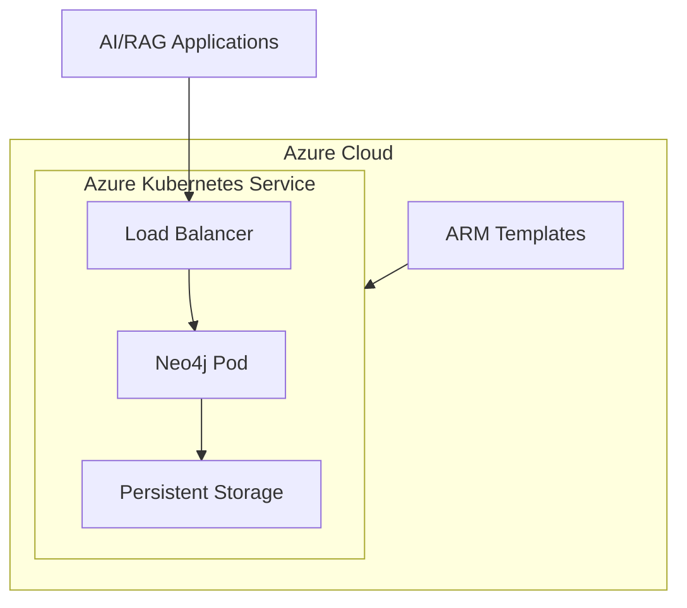

# Neo4j on Azure

## Overview
Infrastructure-as-code project for automated deployment of Neo4j graph databases on Azure Kubernetes Service (AKS), specifically designed to support AI RAG (Retrieval-Augmented Generation) and Agentic projects. This project provides a production-ready knowledge graph database implementation that can be used for:
- Semantic search and retrieval
- Knowledge graph construction
- Context management for LLMs
- Agent memory and reasoning systems

## Architecture



## Prerequisites
- Azure subscription
- Azure CLI
- Kubectl
- Helm
- PowerShell (for Windows deployment) or Bash (for Linux/Mac deployment)

Note: The deployment scripts can automatically install required tools if they're missing.

## Deployment Options

### Windows (PowerShell)
The PowerShell deployment script (`deploy_aks_neo4j.ps1`) provides an automated setup process:

```powershell
./deploy_aks_neo4j.ps1 [-Region eastus2] [-ResourceGroup neo4j-aks-rg] [-Password aksneo4j] [-ClusterName az-neo4j-cluster] [-Namespace neo4j]
```

Features:
- Automated installation of prerequisites (Chocolatey, Helm, Azure CLI, kubectl)
- Azure resource group creation
- AKS cluster deployment
- Neo4j installation via Helm
- Optional plugin installation support

### Linux/Mac (Bash)
The Bash deployment script (`deploy_neo4j_aks.sh`) offers similar functionality:

```bash
./deploy_neo4j_aks.sh [-r region] [-g resource_group] [-p password] [-c cluster_name]
```

Features:
- Prerequisite validation and installation
- Azure resource provisioning
- AKS cluster setup
- Neo4j deployment with Helm
- Plugin installation support

## Configuration Files

### neo4j-values.yaml
Contains Neo4j-specific configurations for the Helm deployment, including:
- Resource allocations
- Storage settings
- Network configurations
- Security settings

### aks-neo4j-values.yaml
AKS-specific configurations for running Neo4j, including:
- Kubernetes resource settings
- Service configurations
- Storage class definitions

## File Structure
- `deploy_aks_neo4j.ps1`: PowerShell deployment script
- `deploy_neo4j_aks.sh`: Bash deployment script
- `neo4j-values.yaml`: Neo4j Helm chart values
- `aks-neo4j-values.yaml`: AKS-specific Helm values
- `main.bicep`: Main Azure infrastructure template
- `resources.bicep`: Additional Azure resource definitions
- `scripts/`: Helper scripts directory
  - `deploy_neo4j_azure.py`: Python deployment utility
  - `get_helm.sh`: Helm installation script
  - `get_kubectl.sh`: Kubectl installation script

## Usage

1. Clone the repository:
```bash
git clone [repository-url]
cd neo4j-on-azure
```

2. Choose your deployment method:

   For Windows:
   ```powershell
   ./deploy_aks_neo4j.ps1
   ```

   For Linux/Mac:
   ```bash
   chmod +x deploy_neo4j_aks.sh
   ./deploy_neo4j_aks.sh
   ```

3. The script will:
   - Install necessary prerequisites
   - Create Azure resources
   - Deploy AKS cluster
   - Install Neo4j using Helm
   - Configure persistent storage
   - Set up network access

4. Access Neo4j:
   - Browser interface: `http://<cluster-ip>:7474`
   - Bolt protocol: `bolt://<cluster-ip>:7687`
   - Default username: neo4j
   - Password: As specified in deployment (default: aksneo4j)

## Customization

### Resource Allocation
Modify `neo4j-values.yaml` to adjust:
- CPU and memory requests/limits
- Storage size and class
- Replica count

### Network Configuration
Update `aks-neo4j-values.yaml` for:
- Service type (LoadBalancer/ClusterIP)
- Port configurations
- Network policies

### Plugin Installation
1. Place plugin JARs in the `neo4j-plugins/` directory
2. Enable plugin installation in the deployment script
3. Plugins will be automatically installed during deployment

## For AI/RAG Applications

This Neo4j deployment is optimized for AI and RAG applications:
- Scalable graph database for knowledge storage
- High-performance query capabilities
- Support for semantic search via plugins
- Integration ready for LLM applications
- Vector storage capabilities for embeddings

## Security Considerations
- Neo4j password is configurable during deployment
- Kubernetes secrets are used for sensitive data
- Network security is enforced via AKS
- RBAC can be configured for fine-grained access control

## Support
For issues and feature requests, please submit them through the project's issue tracker.

## License
[Your License Information]


In order to implement GraphRAG or HybridRAG efficiently for Generative AI applications and architectures, a graph database is need to store and search across ontologies, entities, and relationships. 
This repo creates scripts to allow for the deployment of Neo4j standalone on an Azure Kubernetes Service (AKS) cluster.

The example below shows an HybridRAG architecture. To leverage an implementation of HybridRAG, please see out our other repo: https://github.com/AIGeekSquad/MetaRAG


-- image from datasciencecentral.com --

