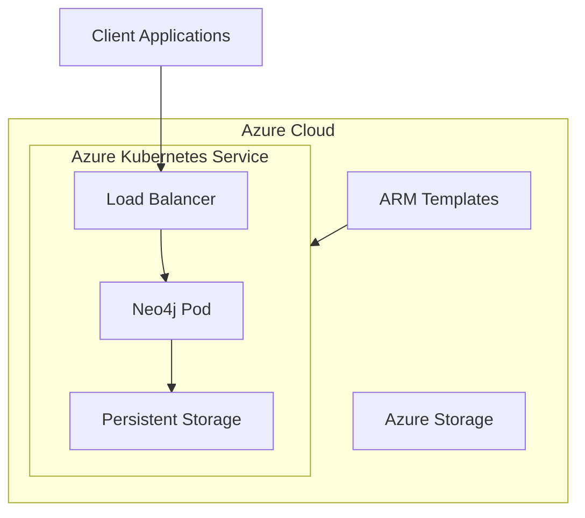
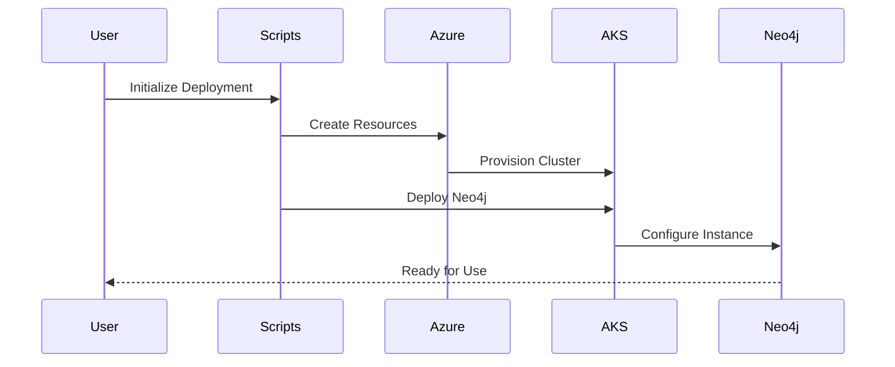
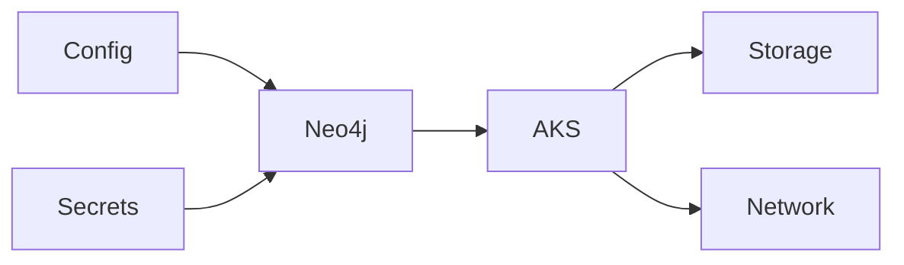

# System Patterns: Neo4j on Azure

## Architecture Overview

## Key Components

### 1. Infrastructure Components
- **Azure Kubernetes Service (AKS)**
  - Managed Kubernetes cluster
  - Node pools for Neo4j workloads
  - Automated scaling capabilities

- **Azure Resource Manager (ARM)**
  - Infrastructure provisioning
  - Resource organization
  - Access control management

### 2. Deployment Components
- **Helm Charts**
  - Neo4j configuration
  - Resource definitions
  - Service configurations

- **Deployment Scripts**
  - Python automation
  - PowerShell scripts
  - Bash scripts

### 3. Storage Components
- **Persistent Volumes**
  - Data persistence
  - Backup storage
  - Configuration storage

## Design Patterns

### 1. Infrastructure as Code
- Bicep templates for Azure resources
- Helm charts for Kubernetes resources
- Version-controlled configurations

### 2. Configuration Management
- Externalized configurations
- Environment-specific values
- Secure secret management

### 3. Deployment Automation
- Scripted deployment process
- Error handling
- Validation checks

### 4. Resource Management
- Dynamic resource allocation
- Scalable infrastructure
- Monitoring and metrics

## Component Relationships

### 1. Deployment Flow

### 2. Resource Dependencies

## Technical Decisions

### 1. Platform Choices
- Azure Kubernetes Service for orchestration
- Helm for package management
- Bicep for infrastructure definition

### 2. Storage Decisions
- Azure managed disks for persistence
- Dynamic provisioning
- Backup strategies

### 3. Security Patterns
- RBAC implementation
- Network security
- Secret management

### 4. Operational Patterns
- Health monitoring
- Resource scaling
- Backup/restore procedures
