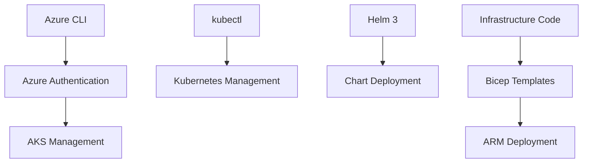

# Technical Context: Neo4j on Azure

## Technology Stack

### Azure Technologies
- **Azure Kubernetes Service (AKS)**
  - Version: Latest stable
  - Features: Managed Kubernetes, RBAC, Azure CNI
  - Purpose: Container orchestration

- **Azure Resource Manager**
  - Templates: Bicep
  - Deployment: ARM API
  - Purpose: Infrastructure provisioning

### Container Technologies
- **Kubernetes**
  - Components: StatefulSets, Services, PersistentVolumes
  - Configuration: Helm charts
  - Networking: Azure CNI, LoadBalancer

- **Neo4j Container**
  - Base Image: Neo4j official
  - Versions: 5.x+
  - Configurations: Customizable via values.yaml

### Infrastructure as Code
- **Bicep**
  - Purpose: Azure resource definitions
  - Files: 
    - main.bicep
    - resources.bicep

- **Helm Charts**
  - Purpose: Neo4j Kubernetes deployment
  - Files:
    - neo4j-values.yaml
    - aks-neo4j-values.yaml

### Deployment Tools
- **Python**
  - Version: 3.x+
  - Purpose: Deployment automation
  - Key Script: deploy_neo4j_azure.py

- **PowerShell**
  - Version: Latest
  - Purpose: Windows deployment support
  - Key Script: deploy_aks_neo4j.ps1

- **Bash**
  - Purpose: Linux/Unix deployment support
  - Key Scripts:
    - deploy.sh
    - deploy_neo4j_aks.sh

## Development Setup

### Prerequisites
1. **Azure CLI**
   - Required for Azure resource management
   - Must be authenticated

2. **Kubernetes Tools**
   - kubectl
   - Helm 3.x+
   - Azure credentials configured

3. **Development Tools**
   - Visual Studio Code
   - Bicep extension
   - Kubernetes extension

### Technical Dependencies

## Technical Constraints

### Resource Requirements
- **Compute**
  - Minimum: 2 vCPU, 4GB RAM per node
  - Recommended: 4 vCPU, 8GB RAM per node

- **Storage**
  - Minimum: 10GB per volume
  - Recommended: 100GB per volume
  - Type: Azure Managed Disks

- **Network**
  - Required Ports:
    - 7474: HTTP
    - 7473: HTTPS
    - 7687: Bolt
    - 6362: Backup (optional)

### Security Requirements
- **Authentication**
  - Azure AD integration
  - RBAC enforcement
  - Service Principal requirements

- **Network Security**
  - VNet integration
  - NSG rules
  - Load Balancer configuration

### Scaling Limitations
- **AKS**
  - Node pool limits
  - Pod scaling constraints
  - Resource quotas

- **Neo4j**
  - Memory requirements
  - Storage scalability
  - Connection limits

## Monitoring & Diagnostics

### Metrics Collection
- Azure Monitor integration
- Kubernetes metrics
- Neo4j metrics

### Logging
- Container logs
- Kubernetes events
- Azure diagnostics

### Observability
- Health probes
- Resource monitoring
- Performance tracking
